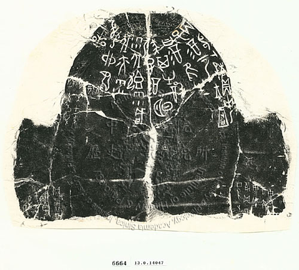

这篇小记记录下这个春节假期做了些什么。

## 线上课程

这个假期完成了 [animations.dev](https://animations.dev) 的课程，这份课程是假期之前付钱买的，这个是我付费的第二个线上教程，之前是 [Just Javascript](https://justjavascript.com/) 。总体收获还是蛮大的，之前就对页面动画还有兴趣，只是一直没有很清晰的认识，只是偶尔用用 `gsap`。这一次终于有了比较全面的认识，之后就是在项目中多练手了，入门成功。

## UI 升级

把 Crane 和 [Docket](https://docket.space) 的 UI 都做了升级，灵感来自于之前看到的新粗野主义设计风格，整体使用更为鲜艳的色彩，更跳跃的字体，感觉自己的设计水平有所提升。其他升级包括：个人网页升级到了 `eleventy v3.0` ， Docket 部署切换到 Dokploy。


<image-compare @name="range-enabled" @value="50">
	
	
</image-compare>


## 读书

读完了两本书，分别是许宏老师的《最早的帝国-二里岗文明冲击波》以及《印加帝国的末日》。这个假期尤其沉迷于石峁、二里头、二里岗、殷墟这段至今依旧神秘的夏商时代，即使已经有大量的考古发现，但是这段历史似乎还是在迷雾之中，每一座城都有着自己的特色，连殷和商这两个字都是谜团，二里岗文明最大的特色是辐射范围很大，推测此时的商应该是很强大的，可是殷墟的整体风格却和二里岗大不同，出现了甲骨文、马车这些跨时代的产物，同样是商，可是考古发现却似乎是两个政权。《印加帝国的末日》是一本读起来非常非常悲痛的书，168 个西班牙人征服和毁灭了一个辉煌的文明，无数的印第安人惨死，伟大的神庙被焚毁，尊贵的君主死于非命，这样的悲剧真是不忍卒读。

## 观影

看了两部剧，《百年孤独》和《照明商店》，均非常推荐。

## 语言

看了一部分 Haskell 的 [文档](https://learnyouahaskell.github.io/chapters.html)，入门太难，仅此而已。
