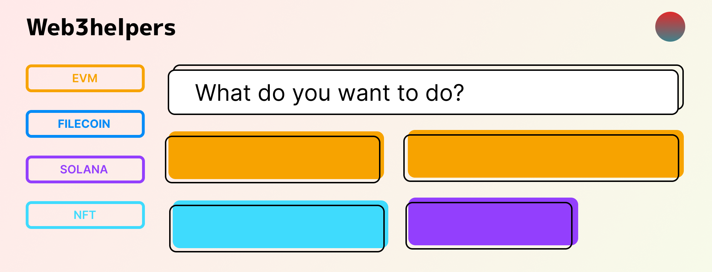
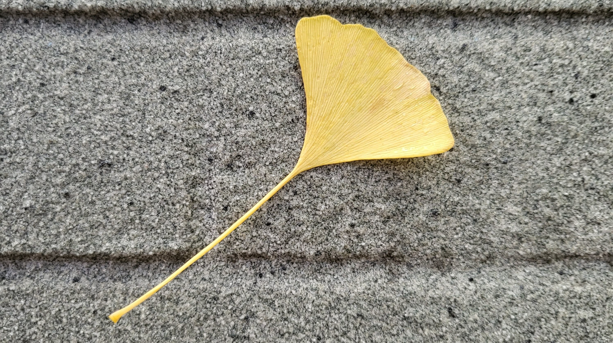

# 2022 年度回顾

今天已经是3月4日了，2023年的3月4日，这个春天特别的冷，在这个寒冷的夜里，终于想起来要补上去年的总结了。最近渐渐开始使用 Notion 来记录每天完成了哪些工作，每天到了晚上下班的时候已经不太起来白天工作的细节，每天太多细碎的工作导致很难记得太多细节，这让我有点担心。既然记不起来，那就把 GitHub Profile 的 2022 记录翻出来看，从12月到1月，也大概知道 2022 都忙了什么。

## 个人项目

2022 年慢慢在尝试自己做一些用 NextJs 开发的项目，使用 Figma 进行设计，虽然都没有推广成功，但是对于产品经理的角色有了更多的认识，也积累了不少的经验。产品功能的初始设计是非常重要，不然很容易完成一个先天不足的产品。

**Lens.ink**

[lens.ink](https://lens.ink)

Lens.ink 是一个基于 Lens Protocol 的 web 应用，目标是想做一个 lens 用户的应用聚合页，在这里可以快速访问 lens 生态内的应用。最后的结果并不如人意，首先是一开始的需求设定就不太正确，这并不是一个很好的需求，最终完成的项目质量也不够高。

这个项目是我最开始使用 NextJs 开发的项目，后来新项目都在用 NextJs 了，工作依旧在用 NuxtJs。另外就是第一次用 GraphQL 的 API。Tailwinds 也用的越来越熟练了。

**Web3Helpers**

[Web3Helpers](https://web3helpers.xyz)

Web3Helpers 是一个 web3 工具集合应用，目标是想把 web3 开发中的一些小任务 UI 化，比如快速创建一个 ERC20 的代币，解析 ETH 的 `rawTransaction`, 或者使用 JSONRPC 的请求。在开发过程中接触了 Solana Aptos Sui 等其他工链，对于这些链有了基本的认识，基于需求也开发了 [Wallet Hooks](https://github.com/web3helpers/wallets-hooks), 开发过程中对于 react hooks 也有了更多的认识。对于每一个小的工具来说都是一个相对独立的应用，所以开发了对应的方便复用的 UI 组件库以及 cli 工具。

现在来看，web3helpers 还是一个不错的项目，2023 年还是值得继续开发的，可能需要开发更复杂的工具，真是添加一个简单的 swap 工具也是个不错的主意。

## 工作

2022 年最重要的工作是在项目中全面使用 typescript。从一开始的各种不顺手到后来变成了不可缺少。typescript 确实极大的提升了 js 的开发体验，也减少了 bug 的发生。一个例子是我写了一个 cli 工具，用于将后端项目的 api 接口文件 自动生成对应的 aixos 请求库，默认支持 typescript，这样在使用这些 api 时就不用再输入返回数据的字段名了，因为 ide 会自动给出提示，在此之前是需要从浏览器中获取到接口返回的数据，再复制对应的字段到代码，这样很容易造成后端修改了字段，前端却没有及时更新的问题，又或者字段名 typo 却没有及时发现。

另外一个工作是建立了 `website-template` 以及 `dapp-template` 项目。前者用于快速创建官网项目，这一年可是写了不少官网啊，后者用于快速创建 dapp。Template 主要是统一了团队内部的插件的使用，并包含了常用的组件。

我利用十一的假期时间搭建了 `abmatrix-ui` 项目，目标是想把工作中常用的一些组件聚合起来，方便以后用的时候快速复用。但是并没有得到很好的维护和利用。

年底几个月都在忙 SBTAuth SDK 的开发，这对于我来说是一个蛮大的挑战，过程中学习到了很多新的知识，尤其是浏览器内消息相关的接口，也一直在不断思考项目的架构以及实现。

2023 年有一个很重要的任务是要升级到 `NuxtJs3.0 `以及对应的` Vue3.0`。

## 生活

2022 年疫情终于在 n 多次的核酸后结束了，健康码终于不用再打开了，感恩家人朋友都顺利度过了。

生活上似乎没有什么大的改变，我开始在咖啡店学习做拉花了，每天进步一点点，越来越爱咖啡了。
今年没有出去玩，后半年读了一些很多魏晋南北朝的书，之前火起来的魏晋热现在终于补上了，果然是个荒谬又迷人的时代。最推荐的书当属罗新老师的 《[漫长的余生](https://book.douban.com/subject/35909188/)》。
最幸运的在 2022 的最后一天，认识了一个很喜欢的女生，希望 2023 年一切顺利吧。