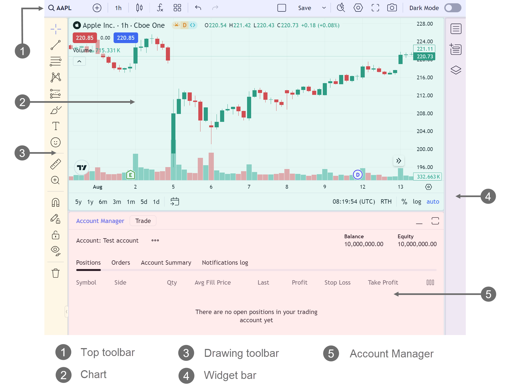
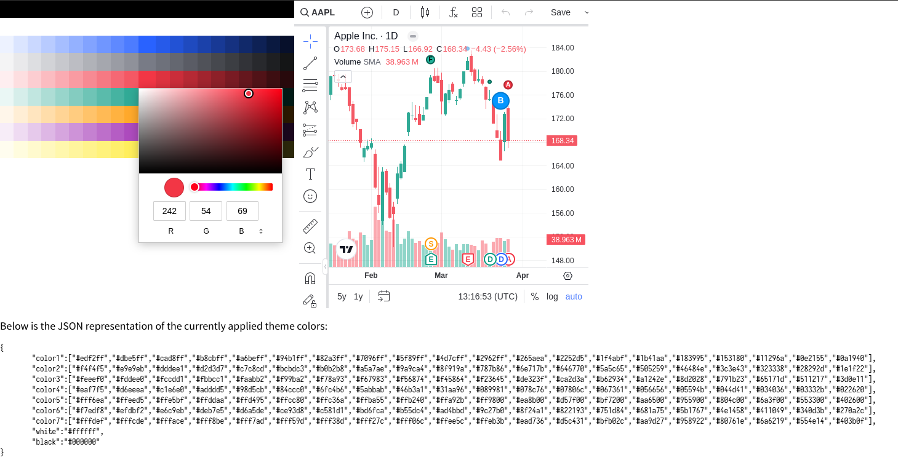

本文介绍的是在 Web 项目中接入 TradingView Advanced Chart 。
## 申请
TradingView Advanced Chart 是免费使用的，代码文件需要通过[官网](https://www.tradingview.com/advanced-charts/)进行申请，申请的时候需要使用公司邮箱，申请后一周内会收到邮件回复，按照邮件内容填写并签署协议文件后回复即可，注意协议文件中邮箱要与申请邮箱保持一致。
## 使用
使用 TradingView widget 分三步。
第一步：
下载 https://github.com/tradingview/charting_library/tree/master/charting_library ，并放到项目公开目录，一般是 `public` 。
第二步：
在 DOM 中插入 `<div id="tv_chart_container"></div>`
第三步：
初始化 `tvWidget` 。

```javascript
window.tvWidget = new TradingView.widget({
    library_path: "path_to_charting_library",
	locale: 'en',
	container: 'tv-chart-container', 
	autosize: true,
	interval: '1', // 1 minute
	favorites: {
		intervals: ['1', '15', '1D'],
	},
	allow_symbol_change: false,
	theme: 'light',
    symbol: `EXCHANGE:BTC/USDT`, // default pair
    timezone: Intl.DateTimeFormat().resolvedOptions().timeZone,
	disabled_features: [...],
	enabled_features: [...],
	custom_themes: {
		light: [...],
		dark: [...]
	},
    datafeed: ...,
});
```

`autosize` 设置为 `true` , 可以让 widget 始终占满父容器大小，这样只需要定义父容器样式就可以了。
`timiezone` 设置 `Intl.DateTimeFormat().resolvedOptions().timeZone` , 可以在界面上按用户时区显示时间。
`disabled_features` 和 `enabled_features` 用于选择功能，当你需要隐藏某些功能时，就需要在这里配置，功能列表具体可参考 `https://www.tradingview.com/charting-library-docs/latest/customization/Featuresets` 。我自己的配置如下：

```js
disabled_features: [
    'symbol_search_hot_key',
    'header_quick_search',
    'header_symbol_search',
    'header_compare',
    'header_settings',
    'header_undo_redo',
    'header_saveload',
    'items_favoriting',
    'symbol_search_hot_key',
    'symbol_info',
    'edit_buttons_in_legend',
    'delete_button_in_legend',
    'use_localstorage_for_settings',
    'create_volume_indicator_by_default',
    'popup_hints',
],
enabled_features: ['show_interval_dialog_on_key_press', 'items_favoriting'],
```

可以参考下图获取 UI 关键字：


`custom_themes`  用于设置主题，一般需要定义 `light` 和 `dark` 主题。
主题包括 `color1` `color2` `color3` `color4` `color5` `color6` `color7` `white` `black` 九个颜色，其中 `color1` 是主题色，`color3` 是红色，`color4` 是绿色。 你可以在这里 https://codepen.io/tradingview/pen/abgzyBW 设置好主题，然后复制到项目中。



剩余一个配置就是 `datafeed` ，这个也是最主要的配置，`datafeed` 主要提供以下方法。文档链接  https://www.tradingview.com/charting-library-docs/latest/connecting_data/datafeed-api/required-methods/#onready 。
```ts
interface Datafeed {
	onReady(callback: OnReadyCallback) => void;
	searchSymbol(
      userInput: string,
      exchange: string,
      symbolType: string,
      onResult: SearchSymbolsCallback,
	) => Promise<void>;
    resolveSymbol(
      symbolName: string,
      onResolve: ResolveCallback,
      onError: DatafeedErrorCallback,
      extension?: SymbolResolveExtension,
    ) => Promise<void>;
    getBars(
      symbolInfo: LibrarySymbolInfo,
      resolution: ResolutionString,
      periodParams: PeriodParams,
      onResult: HistoryCallback,
      onError: DatafeedErrorCallback,
    ) => Promise<void>;
	subscribeBars(
      symbolInfo: LibrarySymbolInfo,
      resolution: ResolutionString,
      onTick: SubscribeBarsCallback,
      listenerGuid: string,
	  onResetCacheNeededCallback: () => void,
    ) => Promise<void>;
	unsubscribeBars(subscriberUID: string) => void	
}
```

`onReady` 图表初始化完成时会调用此方法。`callback` 可以调用一些基础配置。
`searchSymbol` 用于按用户输入搜索代币。
`resolveSymboll` 用户获取代币信息。

```js
const symbolInfo = {
    ticker: 'BTCUSD',
    name: 'BTCUSD',
    description: 'Bitcoin/USD',
    type: symbolItem.type,
    session: '24x7',
    timezone: 'Etc/UTC',
    exchange: 'Example Exchange',
    minmov: 1,
    pricescale: 100,
    has_intraday: false,
    visible_plots_set: 'ohlcv',
    has_weekly_and_monthly: false,
    supported_resolutions: ['1', '5', '30', '60', '1D', '1W'],
    volume_precision: 2,
    data_status: 'streaming',
};
```

`getBars` 用于获取历史数据。
`subscribeBars` 用于更新最新数据。
`unsubscribeBars` 图表切换代币时会调用此方法。

